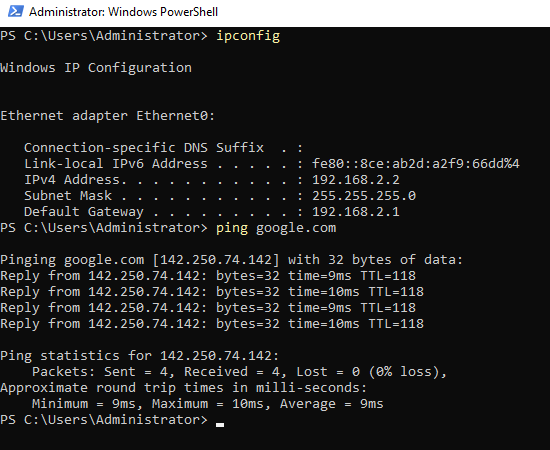

# Environment setup
This is a small single-domain Active Directory (AD) environment build using VMware and pfSense. Currently, it's a simple setup, but  it can be expanded in the future to make a more complex environment. This runs on its own network, with DHCP and DNS managed by the domain controller. Most of the configuration is done using PowerShell, specifically PowerShell Core, both as a way to practice scripting and to enable efficient deployment of the environment.


## Technical requirements
This virtual environment will host the following machines:

| Role               | Hostname | OS                  | IP Address  | Description                                          |
| ------------------ | -------- | ------------------- | ----------- | ---------------------------------------------------- |
| Domain Controller  | DC1      | Windows Server 2022 | 192.168.2.2 | Hosts Active Directory Domain Services, DNS and DHCP |
| Client Workstation | CL1      | Windows 10 Pro      | (DHCP)      | Joined to the AD domain                              |

My environment was created using VMware Workstation. Internet connectivity is established through a bridged connection to a pfSense router.


### VMware tools
In order to copy paste PowerShell code between the host machine and the VMs, we need to install VMware tools **from inside each guest OS**. Since installing VMware Tools requires a reboot, we’ll also change the computer’s hostname now, as that change also triggers a restart.

```powershell
Rename-Computer -NewName "DC1" -Force -PassThru
```

To install VMware Tools, open the settings for the guest operating system in VMware. Under CD/DVD (SATA), set the ISO image file to the equivalent one located in the VMware installation directory (on Windows: C:\Program Files\VMware\VMware Workstation). Once mounted, you can install VMware Tools from the CD-ROM drive in 'This PC' or 'My Computer'.


## Domain controller
Here we will install Active Directory Domain Services (AD DS) on our Windows Server, assigning it the role of Domain Controller for this domain. We will also install the DNS and DHCP services before creating our Active Directory forest.

```powershell
# Run as administrator
Install-WindowsFeature AD-Domain-Services, DHCP, DNS -IncludeManagementTools

$Password = Read-Host -Prompt 'Create admin password' -AsSecureString
Set-LocalUser -Password $Password Administrator
$Params = @{
    DomainName                    = 'dev.local'
    DomainMode                    = 'WinThreshold'
    ForestMode                    = 'WinThreshold'
    InstallDns                    = $true
    SafeModeAdministratorPassword = $Password
    Force                         = $true
}
Install-ADDSForest @Params

Restart-Computer
```

These changes will take effect after a restart.

## Networking
Now we will configure some network settings:
- DC1 will get the static IP-address '192.168.2.2', the second address in the subnet.
- The pfSense router will become the default gateway.
- DC1 will set itself as the DNS server, with the router used for forwarding.

Remember to adjust the address space to match the network configuration of your router.

```powershell
Get-NetIPConfiguration
# Find the 'InterfaceIndex' value and add it to the '$Index' variable
$Index = '<InterfaceIndex>'
$DefaultGateway = '192.168.2.1'
$DCIP = '192.168.2.2'
$Prefix = '24'

New-NetIPAddress -InterfaceIndex $Index -IPAddress $DCIP -PrefixLength $Prefix -DefaultGateway $DefaultGateway
Set-DnsClientServerAddress -InterfaceIndex $Index -ServerAddresses $DCIP
Add-DnsServerForwarder -IPAddress $DefaultGateway
```

If done correctly, we should be able to ping 'google.com', indicating that we have internet connectivity and that DNS resolution is working.



Now we will create a DHCP scope with a pool between '192.168.2.3' and '192.168.2.254', and add a default gateway and DNS server to the pool.
```powershell
Add-DhcpServerv4Scope -Name 'Scope1' -StartRange '192.168.2.3' -EndRange '192.168.2.254' -SubnetMask '255.255.255.0' -State Active

Get-DhcpServerv4Scope
# Add the 'ScopeId' to the 'ID' variable
$ID = '<ScopeId>'

Set-DhcpServerv4OptionValue -ScopeID $ID -DnsServer '192.168.2.2' -DnsDomain 'dev.local' -Router '192.168.2.1' -Force
Add-DhcpServerInDC -DnsName 'DC1.dev.local' -IPAddress '192.168.2.2'
```

## PowerShell Core
Now that we have internet connectivity we will install **PowerShell Core**.

```powershell
Set-ExecutionPolicy Bypass -Scope Process -Force
[System.Net.ServicePointManager]::SecurityProtocol = [System.Net.ServicePointManager]::SecurityProtocol -bor 3072
iex ((New-Object System.Net.WebClient).DownloadString('https://chocolatey.org/install.ps1'))
choco install -y powershell-core
exit
```

All remaining PowerShell commands should be run on this version, unless specified otherwise.

## Organizational Units (OUs)
When new users and computers are added in Active Directory, they are placed in the default **Users** and **Computers** containers, unless specified otherwise. Since these default containers cannot have **Group Policy Objects (GPOs)** linked to them, they are considered less secure. To address this, users and computers should be placed in **Organizational Units (OUs)** instead.

Organizational Units should be structured to facilitate two things:
1. Administrative delegation.
2. Group Policy Objects.

For this small tech company, we will create OUs for each department. In larger organizations, the OU structure may need to be more complex however. Following best practices, we will also separate users and computers into different OUs.

```
Dev.local
│
├── Admins
│
├── AllUsers
│   ├── Management
│   ├── Engineering
│   │   ├── Design
│   │   ├── Production
│   │   └── QA
│   └── IT
│
├── Workstations
│   ├── Management
│   ├── Engineering
|   │   ├── Design
|   │   ├── Production
|   │   └── QA
│   └── IT
│   
└── Servers
```
Lets make some OUs based on the tree structure above. 
```powershell
# Variables 
$pathmgt      =   'OU=AllUsers,DC=dev,DC=local'
$patheng      =   'OU=AllUsers,DC=dev,DC=local'
$pathdes      =   'OU=Engineering,OU=AllUsers,DC=dev,DC=local'
$pathprod     =   'OU=Engineering,OU=AllUsers,DC=dev,DC=local'
$pathqa       =   'OU=Engineering,OU=AllUsers,DC=dev,DC=local'
$pathit       =   'OU=AllUsers,DC=dev,DC=local'
$pathclmgt    =   'OU=Workstations,DC=dev,DC=local'
$pathcleng    =   'OU=Workstations,DC=dev,DC=local'
$pathcldes    =   'OU=Engineering,OU=Workstations,DC=dev,DC=local'
$pathclprod   =   'OU=Engineering,OU=Workstations,DC=dev,DC=local'
$pathclqa     =   'OU=Engineering,OU=Workstations,DC=dev,DC=local'
$pathclit     =   'OU=Workstations,DC=dev,DC=local'

# Admins
New-ADOrganizationalUnit 'Admins' -Description 'Contains OUs and admins'

# Users
New-ADOrganizationalUnit 'AllUsers' -Description 'Contains OUs and regular users'
New-ADOrganizationalUnit 'Management' -Description 'Management staff' -Path $pathmgt
New-ADOrganizationalUnit 'Engineering' -Description 'Engineering staff' -Path $patheng
New-ADOrganizationalUnit 'Design' -Description 'Design staff' -Path $pathdes
New-ADOrganizationalUnit 'Production' -Description 'Production staff' -Path $pathprod
New-ADOrganizationalUnit 'QA' -Description 'QA staff' -Path $pathqa 
New-ADOrganizationalUnit 'IT' -Description 'IT staff' -Path $pathit  

# Workstations
New-ADOrganizationalUnit 'Workstations' -Description 'Contains OUs and workstations'
New-ADOrganizationalUnit 'Management' -Description 'Management workstations' -Path $pathclmgt
New-ADOrganizationalUnit 'Engineering' -Description 'Engineering workstations' -Path $pathcleng
New-ADOrganizationalUnit 'Design' -Description 'Design workstations' -Path $pathcldes 
New-ADOrganizationalUnit 'Production' -Description 'Production workstations' -Path $pathclprod
New-ADOrganizationalUnit 'QA' -Description 'QA workstations' -Path $pathclqa 
New-ADOrganizationalUnit 'IT' -Description 'IT workstations' -Path $pathclit 

# Servers
New-ADOrganizationalUnit 'Servers ' -Description 'Contains OUs and servers'
```

## Users
The following will add some users from a cvs file. This file was made manually using some common first- and last names, and assigning them to some departments and OUs. For that reason the amount of users is rather small. In the future I might add a larger and more complex csv file.

These users will also be assigned a complex password that's generated on user creation.

```powershell
# CSV file
choco install curl
curl -OL https://github.com/Andy-Lindstoel/Active-Directory-Home-Lab/raw/refs/heads/main/docs/AD_users.csv

# Variables
$Users = Import-Csv AD_users.csv -Delimiter ';'
$DomainName = 'dev.local'
$Passwords = 'abcdefghijklmnopqrstuvwxyzABCDEFGHIJKLMNOPRSTUVWXYZ0123456789~!@#$%^&*()-_=+[{]}\|;:<.>/?'

foreach($user in $Users) {
	New-ADuser `
		-GivenName         $user.GivenName `
		-Surname           $user.Surname `
		-Name              ($user.GivenName + ' ' + $user.Surname) `
		-DisplayName       ($user.GivenName + ' ' + $user.Surname) `
		-SamAccountName    ($user.GivenName.ToLower() + '.' + $user.Surname.ToLower()) `
		-UserPrincipalName ($user.GivenName.ToLower() + '.' + $user.Surname.ToLower() + '@' + $DomainName) `
		-Department        $user.Department `
		-Path              $user.Pathname `		
		-AccountPassword   (ConvertTo-SecureString (-join ($Passwords.ToCharArray() | Get-Random -Count 12)) -AsPlainText -Force)`
		-Enabled           $True `
		-ChangePasswordAtLogon $True
}
```

We can now locate these users and their respective OUs in the Server Manager utility, under 'Tools' -> 'Active Directory Users and Computers'.


## Computer
In the Windows 10 virtual machine, the network should be automatically configured on first boot if DHCP is set up correctly. If the network is not configured, verify that the DHCP settings are correct.

Next, we’ll change the hostname and install VMware Tools before restarting the computer, just as we did previously.
```powershell
Rename-Computer -NewName "DC1" -Force -PassThru
```
After restart we’ll join CL1 to the domain. This command will require admin credentials.

```powershell
# Run as administrator in PowerShell (not PowerShell Core)
$cred = Get-Credential -UserName 'DEV\Administrator' -Message 'Admin credentials'
Add-Computer -Credential $cred -DomainName 'dev.local' -PassThru -Verbose
```

## Know Issues and Future Plans
- Add Manager VM and set up remoting.
- Create file share and do AGDLP access control
